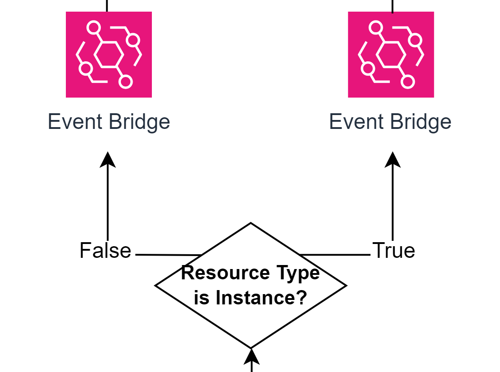
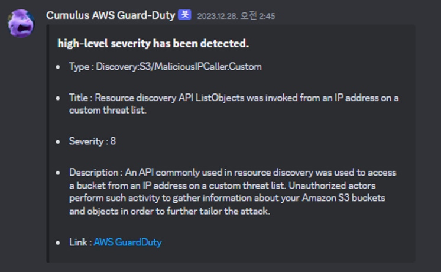
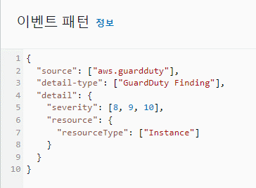

# Artifact-Acquisition

  

아티팩트 채증 자동화 부분
## GuardDuty

  

GuardDuty는 AWS 서비스 중 하나로 ML기반으로 위협행위를 탐지해낸다. 

  

아래와 같이 EC2에 GuardDuty Agent 프로세스를 설치해두면, EC2에서 발생하는 위협행위 또한 탐지해낸다.

  

## Event Bridge

  

Event Bridge는 AWS 서비스 간의 이벤트처리를 담당한다.

GuardDuty에서 8~10정도의 높은 수준의 위협이 탐지 되는 경우 특정 AWS 서비스로 이벤트처리를 하도록 하였다.

이때, 위협이 발생한 위치가 인스턴스인지 아닌지 판별하는데,

  

GuardDuty는 EC2에서 발생한 위협 뿐만 아니라 S3,Iam등 다양한 AWS서비스에서 위협을 탐지 해내기에 EC2에서 발생하는 위협은 아티팩트 채증이 불필요하다고 생각하여, 아티팩트 채증 스텝펑션은 돌리지 않되, 위협수준이 높으므로 디스코드로 알림만 보내도록 람다를 작성하였다.

  

  

  <a href="https://github.com/Cumulus-AWS/Auto-IR-Analysis_Architecture_In_AWS/blob/main/Architecture/Artifact-Acquisition/Threat-Notice_Lambda.py">Threat-Notice_Lambda.py</a>

만약 EC2에서 발생한 위협이라면, 다음과 같은 이벤트 패턴으로 탐지된다.

  

이때, 아티팩트 채증 자동 스텝펑션이 작동하게 된다.

## StepFunction

  

아티팩트 채증 자동 스텝펑션이 동작하면 먼저, 디스코드로 알림이 보내진다.

  

  <a href="https://github.com/Cumulus-AWS/Auto-IR-Analysis_Architecture_In_AWS/blob/main/Architecture/Artifact-Acquisition/0-GuardDuty-Forensic-Discord-Alarm.py">0-GuardDuty-Forensic-Discord-Alarm.py</a>

그후, 휘발성 아티팩트를 수집하여 S3에 저장한다.  
메모리 덤프를 채증 한다.

  

  <a href="https://github.com/Cumulus-AWS/Auto-IR-Analysis_Architecture_In_AWS/blob/main/Architecture/Artifact-Acquisition/1-Lime-auto.py">1-Lime-auto.py</a>

로그, 네트워크, 히스토리등도 채증한다.

  

  <a href="https://github.com/Cumulus-AWS/Auto-IR-Analysis_Architecture_In_AWS/blob/main/Architecture/Artifact-Acquisition/Architecture/Artifact-Acquisition/2-Ec2-Exec-With-SSM.py">2-Ec2-Exec-With-SSM.py</a>

비휘발성 아티팩트 채증을 위해 AMI를 저장한다.  
AMI는 EC2 운영체제, 설정 값, 디스크 스냅샷 등이 저장되어 있다.

  

  <a href="https://github.com/Cumulus-AWS/Auto-IR-Analysis_Architecture_In_AWS/blob/main/Architecture/Artifact-Acquisition/Architecture/Artifact-Acquisition/3-AMI-Snapshot.py">3-AMI-Snapshot.py</a>

아티팩트들을 모두 수집한 이후에는 인 아웃바운드 트래픽을 차단하여, 2차 피해를 방지한다.  
인/아웃바운드 규칙이 없는 보안그룹으로 변경하는 람다가 작동한다.

  

  격리전

  

  격리후

  <a href="https://github.com/Cumulus-AWS/Auto-IR-Analysis_Architecture_In_AWS/blob/main/Architecture/Artifact-Acquisition/Architecture/Artifact-Acquisition/4-Change-Security-Group.py">4-Change-Security-Group.py</a>

이후, 분석 스텝펑션이 동작한다. 
