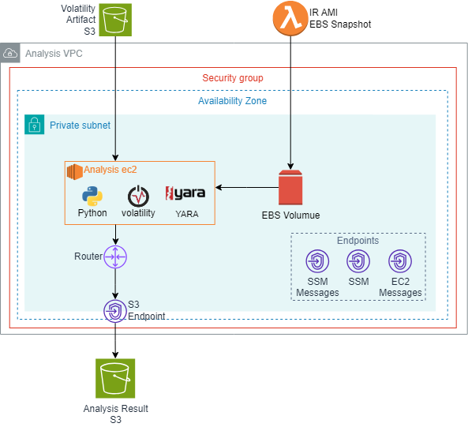
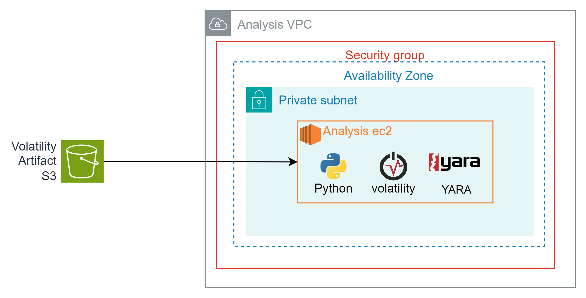
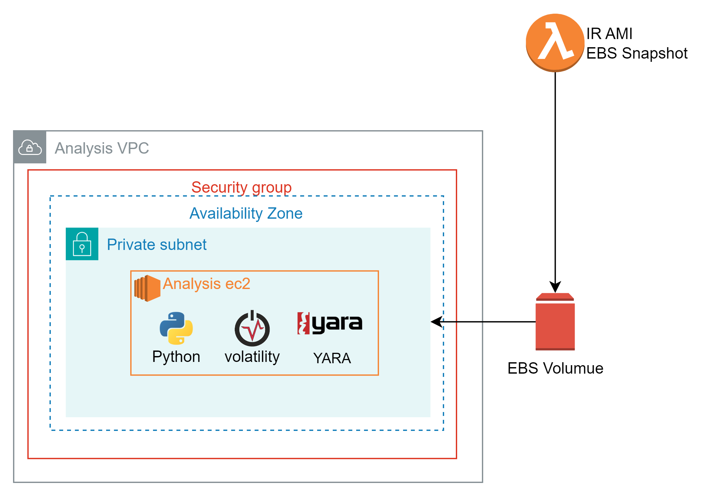

# Artifact-Analysis

  

## index
1. 분석 환경 구성
2. 채증 파일 가져오기
3. AMI 마운트
4. 분석 및 분석 결과 저장

## 분석 환경 구성(?)
사용 도구  
Python 3.7.16 / 2.7.18  
Volatility3  
Yara 4.1.3 (https://github.com/VirusTotal/yara-python)  

S3에 분석에 필요한 도구들을 저장한 후 분석 EC2에서 도구들을 설치한다.

## 채증파일 가져오기

  

## AMI 마운트

  

## 분석 및 분석 결과 저장

  

