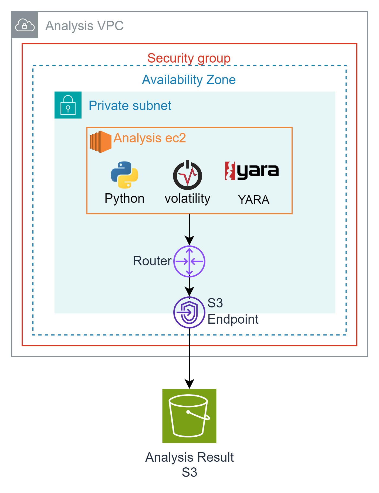

# Artifact-Analysis

  

## index
1. 분석 환경 구성
2. 채증 파일 가져오기
3. AMI 마운트
4. 분석 및 분석 결과 저장

## 분석 환경 구성(?)
사용 도구  
Python 3.7.16 / 2.7.18  
Volatility3  
Yara 4.1.3 (https://github.com/VirusTotal/yara-python)  

S3에 분석에 필요한 도구들을 저장한 후 분석 EC2에서 도구들을 설치한다.

## 채증파일 가져오기

  

앞서 S3에 저장한 아티팩트를 분석하기 위해 분석 EC2로 가져온다.

## AMI 마운트

  

앞서 생성한 AMI를 분석하기 위해 EC2에 연결한다.

이때 수집한 AMI의 무결성을 보존하기 위해 스냅샷을 이용하여 EBS 볼륨을 생성한다.

## 분석 및 분석 결과 저장

  

