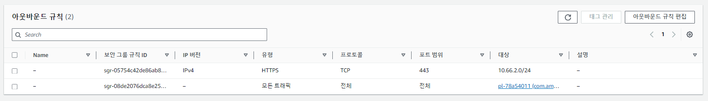

# Artifact-Analysis
<p align="center">
  
</p>

사용 도구 </br>
Python 3.7.16 </br>
Volatility3 </br>
Yara 4.1.3 (https://github.com/VirusTotal/yara-python) </br>

## index
1. 분석 환경 구성
2. 채증 파일 가져오기
3. AMI 마운트
4. 분석 및 분석 결과 저장

## 분석 환경 구축

## 분석 환경 구축
<p align="center">
  
</p>
</br>
침해사고 AMI를 EBS volume으로 복원할때 2차 피해가 발생할 수 있기에, Analysis VPC는 격리된 환경이어야한다.  
아래와 같이 S3 엔드포인트와 SSM엔드포인트 대역대를 제외하고 모든 아웃바운드 트래픽을 차단하였다.
</br>
</br>
<p align="center">
  
</p>
</br>
격리된 환경이기에, 분석 과정에 필요한 도구들은 미리 구축해 둔 퍼블릭 환경의 EC2에 다운받고, 이것의 AMI를 분석 EC2에 적용시키는 방법을 이용하였다.
이 방식을 통해, 분석에 필요한 새로운 도구를 다운받거나, 기존에 사용하던 도구를 업데이트 할 수 있다.


## 채증파일 가져오기
<p align="center">
  
</p>
채증 과정에서 생성된 아티팩트를 분석하기 위해 S3에서 분석 EC2로 가져온다.

```bash
  aws s3 cp s3://cumulus-forensic-artifacti-09a123a785ded16bc/2024-01-03_23:23:28/memory/~lime파일 /home/ec2-user/volatility3/
```


## AMI 연결
<p align="center">
  
</p>
채증 과정에서 생성된 AMI를 분석하기 위해 EC2에 연결한다.
이때 수집한 AMI의 무결성을 보존하기 위해 스냅샷을 이용하여 EBS 볼륨을 생성한다.
<p align="center">
  
</p>
<p align="center">
  AMI
</p>
<p align="center">
  
</p>
<p align="center">
  스냅샷
</p>
<p align="center">
  
</p>
<p align="center">
  EBS 볼륨
</p>
생성된 EBS 볼륨을 EC2에 연결한다.
<p align="center">
  <a href="https://github.com/Cumulus-AWS/Auto-IR-Analysis_Architecture_In_AWS/blob/main/Architecture/Artifact-Analysis/0-Create-EC2.py">0-Create-EC2.py</a>
</p>


## 분석 및 분석 결과 저장
<p align="center">
  
</p>
연결된 볼륨을 분석하기 위해 마운트를 진행한다.
마운트 이후 분석 프로그램인 analysis_software.py을 실행시켜 volatility와 lamda를 이용해 분석을 진행한 후 결과를 S3에 저장한다. 

<p align="center">
  <a href="https://github.com/Cumulus-AWS/Auto-IR-Analysis_Architecture_In_AWS/blob/main/Architecture/Artifact-Analysis/1-Analysis-start.py">1-Analysis-start.py</a>
</p>
