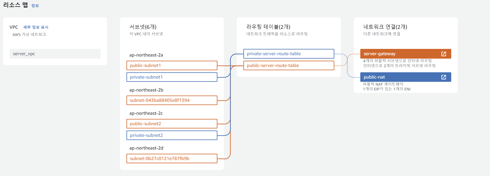

# Server 환경 구축
## index
1. 보안 시스템 구축
1. 취약 환경 구성

## 보안 시스템 구축
**1. 단방향 트래픽**  

  

Server_vpc는 2개의 private subnet과 public subnet으로 구성된다. Private Subnet에는 Server EC2가 존재하고 EC2는 Private Subnet 내에서 오토스케일링된다. Private Subnet은 라우팅 테이블을 통해서 외부에서 직접적인 접근이 불가능하게 설정한다. Public Subnet에는 내부에서 EC2로 접근할 수 있는 Bastion Host가 존재하고 ALB를 통해서 인터넷과 연결된다.
  
트래픽은 InternetGW를 통해서 외부에서 들어온다. 트래픽은 ALB로 전달되고 ALB에서 Public Subnet을 거쳐 Private Subnet의 Server EC2에 요청을 보낸다. 보안그룹을 통해 포트 필터링을 거친 뒤, 요청을 받은 EC2는 NAT Gateway를 통해 아웃바운드 트래픽으로 요청의 결과를 전송한다.
  

**2. EC2 AutoScaling**  

  

EC2는 오토스케일링 그룹을 통해 최소 두 개의 EC2가 오토스케일링되도록 설정되어 있다.  

  

ALB를 통해 트래픽이 자동으로 분산되어 EC2로 전달된다.   

  

Route53에 cumulus.kro.kr 도메인 레코드를 할당하고 도메인을 통해 ALB로 접속하게 된다.
  

**3. NAT Gateway**  

  

NAT Gateway는 Private Subnet의 아웃바운드 트래픽을 인터넷으로 전송한다. NAT Gateway를 통해 Private Subnet은 인터넷과 단방향 통신을 이룬다.
  

**4. WAF**  

  

Internet Gateway를 통해 외부에서 접속을 시도하면, WAF에 의해서 악성 트래픽이 차단된다.  

  

이 프로젝트에서는 로깅 목적으로 WAF를 사용하여 웹 트래픽의 정보를 기록한다. Kinesis Firehase를 통해서 WAF 로그를 수신하고, S3로 전달한다.  
전달된 로그를 이용해 트래픽의 모니터링, 분석 작업을 수행할 수 있다.
  

**5. GuardDuty**  
GuardDuty는 AWS 리소스에 대한 위험탐지 서비스로 Server 환경에서 발생하는 위협을 자동으로 탐지한다.  

  

GuardDuty로 탐지되어도 자동으로 알림이 오지 않기 때문에 CloudWatch 서비스를 활용해 SNS 경보 메시지 환경을 구축했다.   
GuardDuty에서 EC2의 위협을 탐지하기 위해서 각 EC2에 Agent를 설치하여 공격을 탐지할 수 있도록 했다.
  

## 취약 환경 구성
프레임워크 취약점 발생 시의 운영을 테스트 하기 위해서 Log4j 프레임워크 취약점을 사용한다.
Log4j를 이용하여 EC2에 RCE를 감행하여 리버스쉘을 맺어 공격자의 원격 서버와 연결할 수 있다.
취약한 환경 구성을 위해 핫 패치가 진행되기 이전의 Tomcat 8.0.36과 Jdk 1.8.0_20 버전을 사용하여 WAS를 구축한다.  

  

웹브라우저로 접속한 후, 로그인을 할때 Log4j취약점이 존재한다. 이를 통해 리버스쉘을 맺어 공격자는 서버에 접근 할 수 있다.

