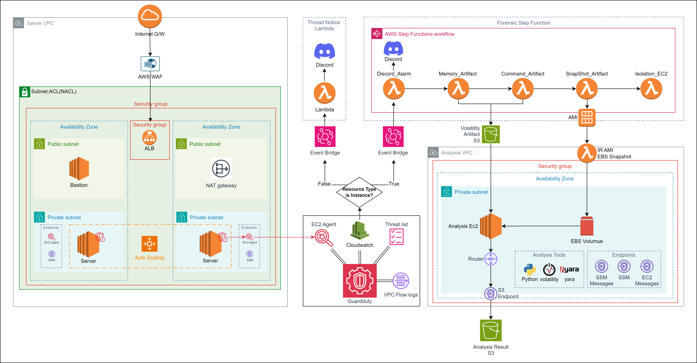

# Auto-IR-Analysis_Architecture_In_AWS

<!-- PROJECT LOGO -->
 

  

  <h3 align="center">AWS 환경에서 침해사고분석을 위한 자동화 아키텍쳐 구성</h3>
  <h3 align="center"> Team. Cumulus </h3>
   
  <h4 align="center"> 본 프로젝트는 화이트햇 스쿨 1기(이하, Pre-BOB)에서 진행된 프로젝트입니다.</h4>
   

  

    안전한 보안 아키텍쳐를 구축하러더라도, 프레임워크 취약점으로부터 발생할 수 있는 침해사고시
     
    빠른 분석과 대응을 위해 자동화 아키텍쳐를 구성한 것이며, 수집된 아티팩트는 법적 효력이 없음을 밝힙니다.
     
     
    <a href="https://github.com/Cumulus-AWS/Auto-IR-Analysis_Architecture_In_AWS"><strong>홈으로 돌아가기</strong></a>
     
     
  

## Index

- [프로젝트 개요](#프로젝트-개요)
  - [팀원 소개](#팀원-소개)
  - [프로젝트 필요성](#프로젝트-필요성)
  - [프로젝트 목표](#프로젝트-목표)

- [프레임워크](#프레임워크)
  - [프레임워크 개요](#프레임워크-개요)
  - [아키텍처 설계](#아키텍처-설계)  
      A. [Server_VPC](#a-server_vpc)  
      B. [채증 자동화](#b-채증-자동화)  
      C. [분석 자동화](#C-분석-자동화)  

- [실제-운영]
  - [시나리오]
  - [시나리오를 통해 도출한 실제 예시]
     
- [AWS 서비스 및 사용 기술](#AWS-서비스-및-사용-기술)
  - [사용한 AWS 서비스](#사용한-AWS-서비스)
  - [기술 스택](#기술-스택)
 
 

## 프로젝트 개요

### 팀원 소개
 

**멘토단 - 밝혀도 되나?**
| 멘토단 | 역할 |
| --- | --- |
| OOO | 멘토 |
| OOO | PL |
 

**큐물러스**
| 이름 | 한줄소개 |
| --- | --- |
| 신우빈 (PM) | - |
| [박선하](https://github.com/waaterr1208) | (활력 감소) |
| [박천웅](https://github.com/CheonWoong-Park) | - |
| [박현재](https://github.com/park1NG) | - |
| [박희진](https://github.com/gmlwlsdl) | - |
| [봉승종](https://github.com/bongjong1121) | 塞翁之馬 |
| [신성훈](https://github.com/bipidus513) | ソコマデダ |
 

### 프로젝트 필요성
**1. AWS 침해사고 증가**  
AWS를 대상으로 한 침해사고의 수와 파급력이 증가하고 있다. 일례로 2019년 발생한 Capital One의 고객정보 해킹 사건이 있다. Capital one 사건은 AWS 클라우드 환경에서 발생한 침해사고로, 해커가 AWS EC2 인스턴스에 악의적인 요청을 보내어 임시 로그인 자격 증명을 획득하였다. 최대 1억명의 Capital one의 고객 개인정보가 유출된 매우 심각한 사건임에도 발생시점과 발견 시점의 5개월 간의 간격이 존재하는 문제점이 발견되었다.  
이와 같은 클라우드 침해 사고 발생 시 이를 분석하기 위한 자동화 구성은 중요하고, 해당 구성에 따라 관리자가 더 빠른 시일 내로 알아차려 사고를 수습하기 위한 골든타임을 놓치지 않을 수 있다.

**2. 기업의 클라우드 마이그레이션**  
"배달의 민족"서비스를 운영하는 푸드테크 기업 "우아한 형제들"은 4년간의 준비 끝에 AWS라는 클라우드 서비스로 모든 서비스를 마이그레이션하였다.
이처럼 다양한 기업들이 기업 특성에 맞추어 온프레미스 환경에서 클라우드 환경으로 마이그레이션 하고 있는 것을 확인 할 수 있다.

**3. On-premise / Cloud 환경 차이로 발생하는 어려움**  
온프레미스 환경의 경우 데이터에 대한 접근 및 제어가 가능하여 침해사고 대응이 상대적으로 용이하지만 클라우드 환경의 경우 물리적 자원에 대한 직접적인 접근이 제한적이며 보안 사고 발생 시 가시성과 통제성이 떨어진다.
또한 가상화 소프트웨어 내에 보안 취약점이 존재하며 Multi-tenancy 환경이므로 보안 취역점이 확산될 수 있는 위험이 있다.

**4. 관련 법안 준수의 필요성**  
대한민국 클라우드컴퓨팅 발전 및 이용자 보호에 관한 법률 제23조에 따르면 클라우드 컴퓨팅 서비스 제공자는 클라우드 컴퓨팅 품질∙성능 및 정보보호 수준을 향상시키기 위하여 노력하여야 한다. 국내 뿐 아니라, 서비스 국가의 법안을 준수하기 위해 클라우드 침해사고의 분석을 통한 보안 수준, 복원력 향상이 필요하다.

### 프로젝트 목표
프로젝트의 목표는 AWS 환경에서의 침해사고 분석을 위한 자동화 아키텍처(or 프레임워크)를 구성하는 것이다.
- 해킹 공격에 의한 침해사고 탐지 후 클라우드 환경에서의 증거를 수집한다.
- 대상 서버에서 휘발성 데이터(memory 등)을 자동 수집하고, 추가 침해사고 분석을 위한 Disk/EC2(서버)스냅샷 등을 자동화하는 아키텍처를 설계한다.

## 프레임워크
### 프레임워크 개요
프로젝트의 전체적인 아키텍처는 크게 세 부분으로 나누어 설명할 수 있다.
  1.	실제 서비스 환경
  2.	침해사고 발생 시 아티팩트 채증 자동화
  3.	채증된 아티팩트를 이용한 분석 자동화 
  
실제 서비스는 Server_VPC에서 이루어지며, 사용자에게 웹 애플리케이션을 서비스한다. Guardduty를 통해서 침해사고가 탐지되면 Stepfuction으로 구성된 아티팩트 채증 자동화 시스템이 작동한다. 그리고 채증된 아티팩트를 통해 Analysis_VPC에서 분석하여 ~~ 결과를 도출한다.

### 아키텍처 설계
아래에 아키텍처에 대해 자세히 설명하고 있다.
#### A. Server_VPC

  

프로젝트에서 가정된 서비스 환경은 Server_VPC를 통해 구현한다. Server_VPC는 두 개의 리전 위에 Public, Private Subnet 각각 1개씩으로 구성된다.
- **Public Subnet**  
Public Subnet은 인터넷 환경에서 접근 가능한 Subnet으로 ALB를 통해 트래픽이 Public Subnet의 노드로 전송되고 Public Subnet을 거쳐 Private Subnet에 위치하는 웹 서버로 전송된다. 또한 바스티온 EC2가 위치하여 개발자가 웹 서버에 접근할 수 있게 한다.
- **Private Subnet**  
Private Subnet은 인터넷을 통해 직접적으로 접근이 불가능하게 해서 ALB를 통해 허용된 트래픽만 서브넷에 접근한다. 웹 서버가 위치하며 NAT를 통해 아웃바운드 트래픽을 연결한다. 이러한 구성을 통해 공격 트래픽이 직접적으로 전달되는 것을 막는다.
- **Web Server**  
웹 서버는 Apache Tomcat을 통해 구축하였다. 직접적으로 접근이 불가능한 Private Subnet에 위치해 있고, 로컬을 통해 전달되는 인바운드 트래픽만 받아들이도록 보안 그룹을 설정했다.
- **EC2 오토스케일링**  
웹 서버는 EC2 오토스케일링을 통해 구성했다. 오토스케일링 그룹을 통해 최소 두 개의 EC2가 오토스케일링 되도록 설정하고, ALB를 통해 인바운드 트래픽이 분산 전송된다.
- **Bastion Host**  
Bastion Host를 통해 개발자가 웹 서버에 접속하여 작업할 수 있다. Ssh로 허용된 IP만 접속할 수 있도록 보안 그룹을 설정했다.
- **GuardDuty**  
GuardDuty 서비스를 사용해서 위협 탐지 시스템을 구축했다. 이 서비스만으로는 위협 탐지 시 알람을 받을 수 없기 때문에, CloudWatch를 활용한 SNS 메시지 환경이 필요하다. 이 프로젝트에서는 Discord를 통해 알람을 받는 환경을 구축하였다.
- **WAF**  
WAF를 통해 웹 서버로 전달된 웹 트래픽 정보를 기록한다. Kinesis Firehose에서 WAF 로그를 수신하고 S3로 전달한다. WAF 로그를 통해 침해사고에 대한 모니터링과 분석 작업을 수행할 수 있다.

### B. 채증 자동화

**1. 네트워크 전이 방지를 위한 Ec2 격리**  
람다를 이용해서 인바운드 및 아웃바운드가 차단된 보안 그룹으로 침해 사고가 발생한 Ec2를 서버로부터 격리 할 수 있도록 한다. 이를 위해서 먼저 인바운드 및 아웃바운드 트래픽을 차단할 보안 그룹을 생성한다. EC2 인스턴스에서 침해 사고가 발생하는 경우 이를 감지하여 람다 함수를 트리거한다. 새로 생성한 보안 그룹으로 변경될 시 침해 사고가 발생한 EC2 인스턴스는 격리되어 더 이상 네트워크 통신을 할 수 없게 되고 추가 공격이 이루어지지 않게 된다.

**2. 휘발성 아티팩트 채증**  
이후 격리한 Ec2에서 휘발성 아티팩트를 채증하는 람다가 작동한다. 휘발성 아티팩트로는 메모리 덤프 아티팩트, 네트워크 통신 로그, 쉘 명령어 히스토리 등이 있다. 메모리 덤프는 잠재적인 악성 코드나 프로세스의 동작을 확인하는 데 도움이 된다. 네트워크 통신 로그의 경우 격리된 EC2의 네트워크 통신을 감시하고, 통신 로그를 수집하여 외부와의 트래픽, 연결된 IP 주소, 포트 등을 분석하여 이상한 동작이나 악의적인 행위를 탐지할 수 있다. 쉘 명령어 히스토리를 통해서는 어떤 명령어가 실행되었는지, 어떤 파일이 실행되었는지 등을 추적할 수 있다.

**3. 비휘발성 아티팩트 채증**  
이후 격리한 Ec2에서 비휘발성 아티팩트를 채증 하는 람다가 작동한다. 현재 아키텍처에서 취급하는 비휘발성 아티팩트는 Ec2의 AMI, 즉 스냅샷이다. 람다 함수는 격리된 EC2의 현재 상태를 기반으로 AMI 스냅샷을 생성한다. 이 스냅샷은 EC2 인스턴스의 운영 체제, 설정, 설치된 애플리케이션 등의 정보를 보관한다.

**4. 채증한 아티팩트를 S3에 전송**  
채증한 휘발성 및 비휘발성 아티팩트들을 S3 버킷에 아카이빙해서 분석 VPC에서 사용할 수 있도록 해야한다. 이를 위해 채증할 아티팩트를 쌓아 둘 S3 버킷을 생성하고 AWS CLI 명령어를 통해 해당 S3로 전송되도록 설정한다. S3에 쌓인 아티팩트들을 분석 VPC에서 사용할 수 있도록 IAM Role을 통한 액세스 권한을 설정하고 VPC 엔드포인트를 설정한다. 

### C. 분석 자동화
(내용)

## 운영 
본 시나리오에서는 WAF, 보안 그룹, NAT Gateway 등과 같은 보안 서비스들이 실행되고 있음에도 불구하고, 프레임워크 취약점은 이러한 보호 장치들을 회피할 수 있음을 드러낸다. 본 시나리오를 통해서 구축한 침해 사고 대응 자동화 프로세스가 어떻게 효과적으로 대응할 수 있는지 확인할 수 있다. 
### 공격 시나리오 

1. 웹에 접근(cumulus.kro.kr)
2. log4j 취약점을 이용하여 공격 진행
3. 공격자의 원격 서버와의 연결

EC2에서 작동 중인 Apache Tomcat 서버는 사용자 인증을 위한 로그인 인터페이스를 제공하고, 
공격자는 인터페이스의 ID 입력란에 `${jndi:~}` 형태의 악성 코드를 삽입하여 공격을 개시한다. 
보간 구문을 이용한 이 공격은 서버의 로깅 과정을 악용하여 JNDI를 사용, 공격자의 원격 서버와의 연결을 설정하고 원하는 코드를 실행한다. 

공격자는 이 방법을 통해 서버에 리버스 쉘을 설치한다. 

### 침해사고 대응 프로세스 
침해사고가 발생한 후, 아키텍처에서 정의된 대응 프로세스는 다음과 같이 작동한다. 
- **GuardDuty 탐지**  
  GuardDuty가 의심스러운 활동을 감지하고, 발생한 이벤트가 인스턴스 관련 이벤트인지 확인한다.
  
- **StepFunctions 활성화**  
  인스턴스 이벤트라면, StepFunctions 워크플로우가 활성화되어 자동화된 대응 조치를 시작한다.
  
  - **Discord 알람 전송**  
    침해사고가 발생했음을 알리는 알람을 Discord로 전송한다.
    
  - **Artifact 채증**  
    Memory Artifact와 Command Artifact를 채증한다.
    
  - **SnapShot 생성 및 인스턴스 격리**  
    비휘발성 데이터를 분석하기 위해 인스턴스의 스냅샷을 생성하고, 피해 확산을 방지하기 위해 해당 인스턴스를 네트워크적으로 격리한다.
    
- **분석 및 조사**  
  채집된 정보는 Analysis VPC 내에서 분석된다. 

## 표 + 사진 방법 1

| JavaScript | TypeScript |  React   |  Node   |
| :--------: | :--------: | :------: | :-----: |
|   ![js] 사진들어갈곳   |   ![ts]    | ![react] | ![node] |

## 표 + 사진 방법 2

|  이름 |  Internet Explorer |  Edge |  Safari |  Firefox |
| :---------: | :---------: | :---------: | :---------: | :---------: |
| Yes | 11+ | Yes | Yes | Yes |

##
[js]: /git 내 이미지 경로
[ts]: /git 내 이미지 경로
[react]: /git 내 이미지 경로
[node]: /git 내 이미지 경로

## 참고자료  
취약 서버 구축 : https://velog.io/@isang/CVE-2021-44228log4shell-취약점-POC-실습
