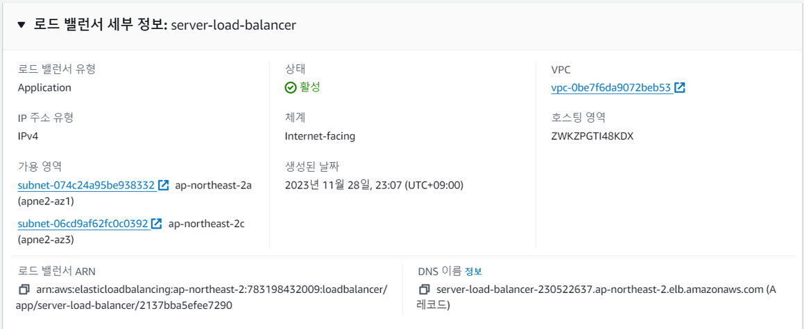

# Auto-IR-Analysis_Architecture_In_AWS

<!-- PROJECT LOGO -->
<br />
<div align="center">
  <a href="https://github.com/othneildrew/Best-README-Template">
    
  </a>

  <h3 align="center">AWS 환경에서 침해사고분석을 위한 자동화 아키텍쳐 구성</h3>
  <br />
  <h4 align="center"> 본 프로젝트는 화이트햇 스쿨 1기(이하, Pre-BOB)에서 진행된 프로젝트입니다.</h4>
  <br />

  <p align="center">
    안전한 보안 아키텍쳐를 구축하러더라도, 프레임워크 취약점으로부터 발생할 수 있는 침해사고시
    <br />
    빠른 분석과 대응을 위해 자동화 아키텍쳐를 구성한 것이며, 수집된 아티팩트는 법적 효력이 없음을 밝힙니다.
    <br />
    <br />
    <a href="https://github.com/Cumulus-AWS/Auto-IR-Analysis_Architecture_In_AWS"><strong>홈으로 돌아가기</strong></a>
    <br />
    <br />
    <a href="https://github.com/othneildrew/Best-README-Template">View Demo</a>
    ·
    <a href="https://github.com/othneildrew/Best-README-Template/issues">Report Bug</a>
    ·
    <a href="https://github.com/othneildrew/Best-README-Template/issues">Request Feature</a>
  </p>
</div>

## Index

- [프로젝트 개요](#프로젝트-개요)
  - [팀원 소개](#팀원-소개)
  - [프로젝트 필요성](#프로젝트-필요성)
  - [프로젝트 목표](#프로젝트-목표)

- [아키텍처 및 서버 인프라](#아키텍처-및-서버-인프라)
  - [서버 인프라 구축](#서버-인프라-구축)
  - [아키텍처 설계](#아키텍처-설계)
  - [Workflow](#Workflow)
  
- [운영](#운영)
  - [Scripts](#Scripts)
  - [아티팩트 채증 자동화](#아티팩트-채증-자동화)
  - [아티팩트 분석 자동화](#아티팩트-분석-자동화)
     
- [AWS 서비스 및 사용 기술](#AWS-서비스-및-사용-기술)
  - [사용한 AWS 서비스](#사용한-AWS-서비스)
  - [기술 스택](#기술-스택)
<br />
<br />

## 프로젝트 개요

### 팀원 소개
<br />

**멘토단 - 밝혀도 되나?**
| 멘토단 | 역할 |
| --- | --- |
| OOO | 멘토 |
| OOO | PL |
<br />

**큐물러스**
| 이름 | 한줄소개 |
| --- | --- |
| 신우빈 (PM) | - |
| [박선하](https://github.com/waaterr1208) | - |
| [박천웅](https://github.com/CheonWoong-Park) | - |
| [박현재](https://github.com/park1NG) | - |
| [박희진](https://github.com/gmlwlsdl) | - |
| [봉승종](https://github.com/bongjong1121) | 塞翁之馬 |
| [신성훈](https://github.com/bipidus513) | ソコマデダ |
<br />

### 프로젝트 필요성
**1. AWS 침해사고 증가**  
Capital one 사건은 AWS 클라우드 환경에서 발생한 침해사고로, 해커가 AWS EC2 인스턴스에 악의적인 요청을 보내어 임시 로그인 자격 증명을 획득 하였다.
최대 1억명의 Capital one의 고객 개인정보가 유출된 매우 심각한 사건임에도 발생시점과 발견 시점의 5개월 간의 간격이 존재하는 문제점이 발견되었다.
위 사례처럼 클라우드 침해 사고 발생 시 이를 분석하기 위한 자동화 구성은 중요하고, 해당 구성에 따라 관리자가 더 빠른 시일 내로 알아차려 사고를 수습하기 위한 골든타임을 놓치지 않을 수 있다

**2. 기업의 클라우드 마이그레이션**  
"배달의 민족"서비스를 운영하는 푸드테크 기업 "우아한 형제들"은 4년간의 준비 끝에 AWS라는 클라우드 서비스로 모든 서비스를 마이그레이션하였다.
이처럼 다양한 기업들이 기업 특성에 맞추어 온프레미스 환경에서 클라우드 환경으로 마이그레이션 하고 있는 것을 확인 할 수 있다.

**3. On-premise / Cloud 환경 차이로 발생하는 어려움**  
온프레미스 환경의 경우 데이터에 대한 접근 및 제어가 가능하여 침해사고 대응이 상대적으로 용이하지만 클라우드 환경의 경우 물리적 자원에 대한 직접적인 접근이 제한적이며 보안 사고 발생 시 가시성과 통제성이 떨어진다.
또한 가상화 소프트웨어 내에 보안 취약점이 존재하며 Multi-tenancy 환경이므로 보안 취역점이 확산될 수 있는 위험이 있다.

**4. 관련 법안 준수의 필요성**  
클라우드컴퓨팅 발전 및 이용자 보호에 관한 법률 제23조에 따르면 클라우드 컴퓨팅 서비스 제공자는 클라우드 컴퓨팅 품질 / 성능 및 정보보호 수준을 향상시키기 위하여 노력하여야 한다.

### 프로젝트 목표
**AWS 환경에서 침해사고 분석을 위한 자동화 구성**<br />
- 해킹 공격에 의한 침해사고 탐지 후 클라우드 환경에서의 증거를 수집한다.
- 대상 서버에서 휘발성 데이터(memory 등)을 자동 수집하고, 추가 침해사고 분석을 위한 Disk/EC2(서버)스냅샷 등을 자동화하는 아키텍처를 설계하는 것

## 아키텍처 및 서버 인프라

### 서버 인프라 구축

서버 VPC
1. VPC 설정
    * Server_VPC 생성
2. Subnet
    * Public Subnet
      * EC2 오토스케일링 영역
      * 라우팅 테이블을 통해서 외부에서 직접적인 접근이 불가능하게 설정
    * Private Subnet
      * 내부에서 EC2로 접근할 수 있는 Bastion 생성
      * ALB를 통해 인터넷과 연결됨
3. Security Group
    * 
4. EC2 오토스케일링
    * 사용자가 지정한 규칙에 따라 EC2 인스턴스 수를 자동으로 조정하는 서비스
    * 오토스케일링 그룹을 통해 최소 두 개의 EC2가 오토스케일링 되도록 설정
    * Route53에 cumulus.kro.kr 도메인 레코드 할당
5. ALB
    * 애플리케이션 트래픽을 여러 대의 EC2 인스턴스 등에 자동으로 분산
    * ALB를 이용하여 private subnet에 있는 두 개의 EC2 으로 인바운드 트래픽을 분산 전송
6. NAT gateway
    * Private Subnet의 아웃바운드 트래픽을 연결
    * Private Subnet은 단방향 통신을 이룸
7. WAF 로깅
    * WAF에 의해 감시된 웹 트래픽 정보 기록
    * Kinesis Firehose에서 WAF 로그 수신, S3로 전달
    * S3에서는 모니터링, 분석 작업을 수행할 수 있음
8. Endpoint 및 Gateway
    * 
9. GuardDuty
    * AWS 리소스 "ex.EC2"에 대한 위험탐지 서비스
    * 위험 탐지 시 자동으로 알람 해주지 않기 때문에 CloudWatch 서비스를 활용한 SNS 경보 메시지 환경 구축이 필요
    * 따라서 Event Bridge에서 위협 레벨이 5를 초과 시 생성한 SNS Topic 구독을 통해 Discord로 알람을 받는 환경을 구축

분석 VPC
1. VPC 설정
    * ~~
2. Endpoint 및 Gateway
    * ~~
3. EC2
    * ~~
4. Security Group
    * ~~

### 아키텍처 설계
(내용)

### Workflow
(내용)

## 운영
### Scripts

### 아티팩트 채증 자동화

### 아티팩트 분석 자동화

취약 자바 설치 :

```sh
curl -L -b "oraclelicense=accept-securebackup-cookie" -O https://download.oracle.com/otn/java/jdk/8u20-b26/jdk-8u20-linux-x64.tar.gz

tar -zxvf jdk-8u20-linux-x64.tar.gz

cd jdk1.8.0_20

export JAVA_HOME=$(pwd)

export PATH=$PATH:$JAVA_HOME/bin

echo 'export JAVA_HOME=$(pwd)' >> ~/.bashrc
echo 'export PATH=$PATH:$JAVA_HOME/bin' >> ~/.bashrc
source ~/.bashrc

java -version
```

톰캣설치:

```sh
wget http://archive.apache.org/dist/tomcat/tomcat-8/v8.0.36/bin/apache-tomcat-8.0.36.tar.gz

tar -xzvf apache-tomcat-8.0.36.tar.gz

cd apache-tomcat-8.0.36

앱 뭐시꺵이에 ROOT로 이름 바꿔서 war넣고 

cd bin

./catalina.sh run
```

## 자동화 시스템
### 아티팩트 채증 자동화
### 아티팩트 분석 자동화

## AWS 서비스 및 사용 기술

### 사용한 AWS 서비스
1. VPC
    * 사용자가 정의한 가상 네트워크에서 AWS 리소스를 시작할 수 있도록 하는 서비스<br />
1. EC2
    *  사용자가 정의한 가상 네트워크에서 가상 서버(인스턴스)를 프로비저닝하고 실행할 수 있게 해주는 서비스<br />
1. S3
    * 데이터를 저장하고 검색할 수 있는 안전하고 확장 가능한 클라우드 스토리지를 제공해주는 객체 스토리지 서비스<br />
1. EC2 오토스케일링
    * 사용자가 지정한 규칙에 따라 EC2 인스턴스 수를 자동으로 조정하는 서비스<br />
1. ALB
<br />
    * 애플리케이션 트래픽을 여러 대의 EC2 인스턴스 등에 자동으로 분산시켜주는 서비스<br />
1. WAF 로깅
    * WAF에 의해 감시된 웹 트래픽 정보 기록하는 서비스<br />
1. GuardDuty
    * AWS 리소스 "ex.EC2"에 대한 위험탐지 서비스<br />
1. Lamda
    * 서버를 프로비저닝하거나 관리하지 않고도 코드를 실행함, 자동화 작업 수행에 이용<br />
1. Step Function
    * Serverless 오케스트레이션 서비스<br />
1. Route 53
    * 도메인 이름을 관리하고 애플리케이션을 연결<br />
1. CloudWatch
    *  AWS 리소스 및 애플리케이션의 모니터링과 로깅 서비스, 성능 지표를 추적하고 이벤트에 대응<br />
1. SSM
    * EC2 인스턴스 및 환경을 관리하기 위한 서비스, 자동화 및 운영 작업을 수행<br />

### 기술 스택
1. [LiME](https://github.com/504ensicsLabs/LiME)</br>
리눅스 시스템에서 메모리 덤프를 추출하는 도구
2. Volatility</br>
메모리 포렌식 분석 도구로 다양한 운영 체제에서 메모리 덤프를 분석하는 도구

## 표 + 사진 방법 1

| JavaScript | TypeScript |  React   |  Node   |
| :--------: | :--------: | :------: | :-----: |
|   ![js] 사진들어갈곳   |   ![ts]    | ![react] | ![node] |

## 표 + 사진 방법 2

|  이름 |  Internet Explorer |  Edge |  Safari |  Firefox |
| :---------: | :---------: | :---------: | :---------: | :---------: |
| Yes | 11+ | Yes | Yes | Yes |


##
[js]: /git 내 이미지 경로
[ts]: /git 내 이미지 경로
[react]: /git 내 이미지 경로
[node]: /git 내 이미지 경로
